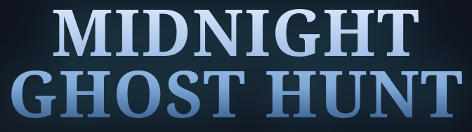

  

## Play it!

[TO BE IMPLEMENTED]

## Game overview

Midnight Ghost Hunt is first-person ghost hunt game built with **three.js**, **ammo.js** and **tween.js**.
The game is set in a haunted graveyard. The player’s objective is to
eliminate all the ghosts in the map using a ray-gun. The game combines elements of action, resource management, and survival. 

## Game controls

- **W A S D / arrows:** move
- **Mouse:** look around
- **Left click:** fire the ray 
- **Esc:** pause/menu

## Win conditions

- **Victory:** The player kills all the ghosts in the graveyard
- **Game Over:** The player loses all their hearts

## Settings

The game presents a settings menu for both difficulty (easy, medium and hard) and graphics (low, medium and high).
"Pacific Mode" is a gameplay mode that allows wandering around the graveyard without being attacked by ghosts.

## World features 

- **Tree with a cage:** Interactive hierarchical model 
- **Tombstones:** Obstacles with ambient animations
- **Smoke and Atmosphere:** Layered and drifting ambiance feature
- **Fences:** Metallic and reflective map border
- **Ray Gun:** The player's tool to hit ghosts

## Ghost enemies

- **Normal Ghosts:** Get eliminated in 1 hit
- **Wraiths:** Bosses that require 3 hits to kill and can regain 1 heart if they hit the player

## Code structure

[TO BE IMPLEMENTED]

## Credits

All the credits and licenses for the imported 3D models are present in CREDITS.md
